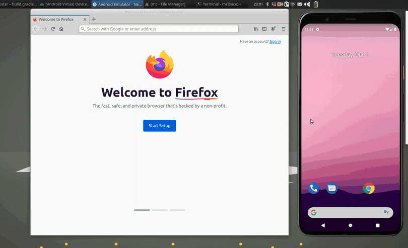

# Clipster - Desktop Client

[](https://github.com/mc51/Clipster-Desktop/actions)


Clipster is a multi platform cloud clipboard:  
Copy a text on your smartphone and paste it on your desktop, or vice versa.  
Easy, secure, open source.  
Supports Android, Linux, MacOS, Windows and all browsers.   

You can use the web front-end of the public server at [clipster.cc](https://clipster.cc).  
For the Android client see [Clipster-Android](https://github.com/mc51/Clipster-Android).  
To run your own server check [Clipster-Server](https://github.com/mc51/Clipster-Server).  
  
  
  
## Easy Setup

### Linux 

Copy and paste the following in bash to clone the git repo and start the `install.sh` script:

``` bash
git clone https://github.com/mc51/Clipster-Desktop.git && cd Clipster-Desktop && sh install.sh
```

The install script takes care of everything.  

### Windows

Download [`clipster.exe`](https://github.com/mc51/Clipster-Desktop/releases/latest/download/clipster.exe) from the latest Windows release and start it. To automatically start Clipster, open the current user's auto-start folder by opening Explorer and typing `shell:startup`. Copy `clipster.exe` there. 

### MacOS

Download [`clipster.zip`](https://github.com/mc51/Clipster-Desktop/releases/latest/download/clipster.zip) from the latest MacOS release, move it to `Applications` and start it. You might get a warning message, that you need to ignore. Newer MacOS versions might even prevent you from opening it entirely at first. You have [two options](https://support.apple.com/guide/mac-help/open-a-mac-app-from-an-unidentified-developer-mh40616/mac):  
1. Open it in the Finder via `right click --> open`
2. After failing to open it, go to `System Preferences --> Security & Privacy`. In the `General` Tab the App will be listed and you can start it from there
  
To automatically start Clipster, right click on the icon in your Dock and click on `Options --> Open at Login`.  
    
Now, you can [use](#usage) clipster!  

## Manual Setup

If you absolutely need to, you can install manually.

### Linux 

First, clone the repo:

``` bash
git clone https://github.com/mc51/Clipster-Desktop.git && cd Clipster-Desktop
```
  
Second, install the python package:

``` bash
pip install .
```

Now, the `clipster` command will be available in the command line. Clipster depends on the `xsel` or `xclip` packages. On some distributions, you will to need manually install them. On Debian/Ubuntu do:

```bash
sudo apt-get install xsel
```

For a convenient experience, you should run clipster as a background service. For this, you need to setup a `systemd` service. First, find the absolute path to your installation:

```bash
whereis clipster
```

Following, create the file (as root) `/etc/systemd/system/clipster.service` with the following content:

```
[Unit]
Description=Clipster - A Multi Platform Cloud Clipboard Clipboard
After=network.target

[Service]
WorkingDirectory=/tmp
ExecStart=<PATH>
ExecReload=/bin/kill -s HUP $MAINPID
ExecStop=/bin/kill -s TERM $MAINPID
Restart=always
RestartSec=1

[Install]
WantedBy=multi-user.target
```

Change \<PATH\> to your installation path. Now, run the following to reload the configuration, enable auto start, and start the service:

```bash
sudo systemctl daemon-reload
sudo systemctl enable clipster
sudo systemctl start clipster
```

Finally, check the status with:

```bash
sudo systemctl status clipster
```

If all went fine, you should see:

``` bash
● clipster.service - Clipster - A Multi Platform Cloud Clipboard
   Loaded: loaded (/etc/systemd/system/clipster.service; enabled; vendor preset: enabled)
   Active: active (running) since Mon 2020-08-01 12:00:0 CEST; 30min ago
```

Now, you can [use](#usage) clipster!

## Usage

On the first startup, you can either register a new account or enter your existing credentials for the login. Your credentials will be stored in your `HOMEPATH` in `./config/clipster/config`.  
Clipster will add an Icon to your system tray which you can click for opening up a menu with the following options:  
`Get last Clip` will fetch the last shared Clip from the server.  
`Get all Clips` will fetch all shared Clips from the server.  
`Share Clip` will share your current clipboard. Then, it's available for all your devices.  
`Edit Credentials` allows you to register a new account or change your login credentials.  
`Exit` will terminate the app.  

## Roadmap

- [x] Encrypt / Decrypt clipboard locally and only transmit encrypted data to server
- [x] Add clipboard history: share multiple Clips
- [ ] Support image sharing
- [ ] iOS Client


## Contributions

Contributions are very welcome. If you come across a bug, please open an issue. The same thing goes for feature requests.

## Credits

Client based on [cloud-clipboard](https://github.com/krsoninikhil/cloud-clipboard).  
Install script based on [Docker](https://www.docker.com/).
