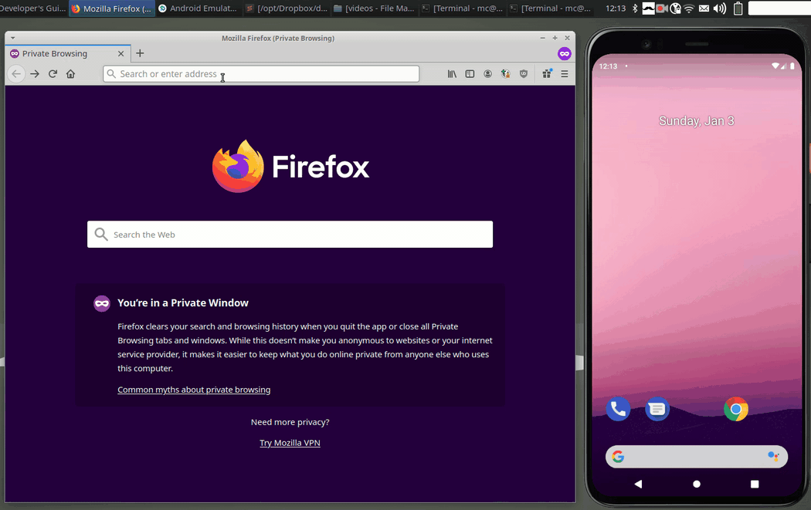

# Clipster - Desktop Client (Python)

[](https://github.com/mc51/Clipster-Desktop-Py/actions) [](https://pypi.org/project/clipster-desktop)  

Clipster is a multi platform cloud clipboard:  
Copy a text on your smartphone and paste it on your desktop, or vice versa.  
Easy, secure, open source.  
Supports Android, Linux, MacOS, Windows and all browsers.   

For a more up to date Desktop client written in Go see [Clipster-Desktop](https://github.com/mc51/Clipster-Desktop)    
You can use the web front-end of the public server at [clipster.cc](https://clipster.cc).  
For the Android client see [Clipster-Android](https://github.com/mc51/Clipster-Android).  
To run your own server check [Clipster-Server](https://github.com/mc51/Clipster-Server).  
  
  
  
## Setup

### Linux 

Install via pip:

``` bash
pip install clipster-desktop
```

Then, `clipster` will be available as a terminal command. To enable auto-start, execute the following setup script:

``` bash
clipster_enable.sh
```

This will add a Clipster service to [systemd](https://en.wikipedia.org/wiki/Systemd). (To disable auto-start, run `clipster_disable.sh`)  
  

Alternatively, install the latest version from GitHub. Copy and paste the following in the console to clone the git repo and start the `install.sh` script:

``` bash
git clone https://github.com/mc51/Clipster-Desktop-Py.git && cd Clipster-Desktop-Py && sh scripts/install.sh
```

The install script takes care of everything.  

### Windows

Download [`clipster.exe`](https://github.com/mc51/Clipster-Desktop-Py/releases/latest/download/clipster.exe) from the latest Windows release and start it. To automatically start Clipster, open the current user's auto-start folder by opening Explorer and typing `shell:startup`. Copy `clipster.exe` there. 

### MacOS

Download [`clipster.zip`](https://github.com/mc51/Clipster-Desktop-Py/releases/latest/download/clipster.zip) from the latest MacOS release, move it to `Applications` and start it. You might get a warning message, that you need to ignore. Newer MacOS versions might even prevent you from opening it entirely at first. You have [two options](https://support.apple.com/guide/mac-help/open-a-mac-app-from-an-unidentified-developer-mh40616/mac):  
1. Open it in the Finder via `right click --> open`
2. After failing to open it, go to `System Preferences --> Security & Privacy`. In the `General` Tab the App will be listed and you can start it from there  
  
To automatically start Clipster, right click on the icon in your Dock and click on `Options --> Open at Login`.  
    
Now, you can [use](#usage) clipster!  
  
## Usage

On the first startup, you can either register a new account or enter your existing credentials for the login. Your credentials will be stored in your `HOMEPATH` in `./config/clipster/config`.  
Clipster will add an Icon to your system tray which you can click for opening up a menu with the following options:  
`Get last Clip` will fetch the last shared Clip from the server.  
`Get all Clips` will fetch all shared Clips from the server.  
`Share Clip` will share your current clipboard. Then, it's available for all your devices.  
`Edit Credentials` allows you to register a new account or change your login credentials.  
`Exit` will terminate the app.  

## Roadmap

- [x] Encrypt / Decrypt clipboard locally and only transmit encrypted data to server
- [x] Add clipboard history: share multiple Clips
- [x] Add PyPi package
- [ ] Support image sharing
- [ ] iOS Client  
  
## Contributions

Contributions are very welcome. If you come across a bug, please open an issue. The same thing goes for feature requests.

## Credits

Client based on [cloud-clipboard](https://github.com/krsoninikhil/cloud-clipboard).  
Install script based on [Docker](https://www.docker.com/).
